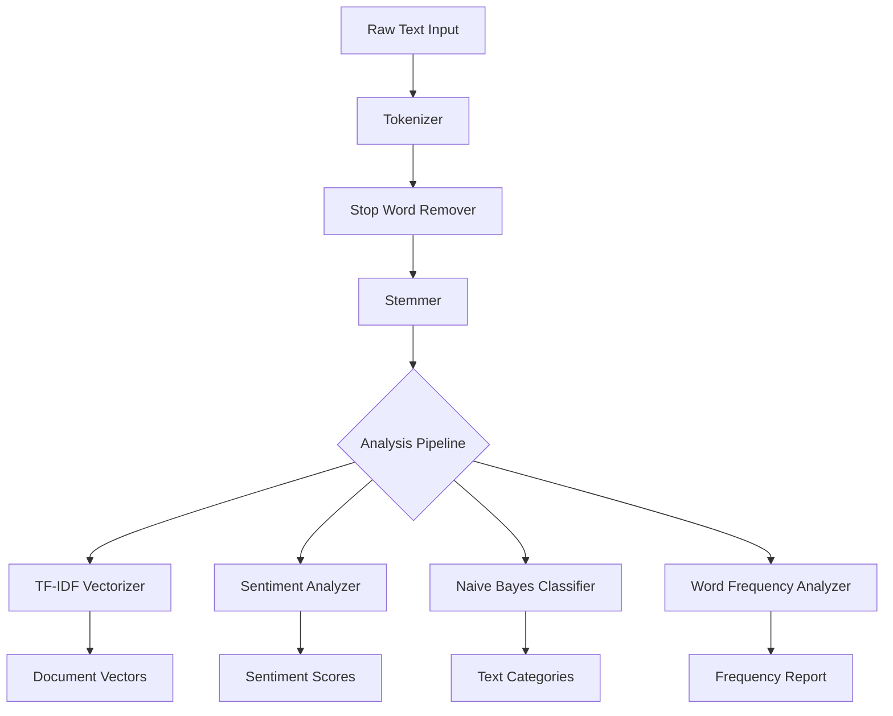
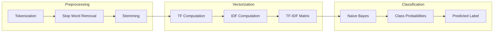
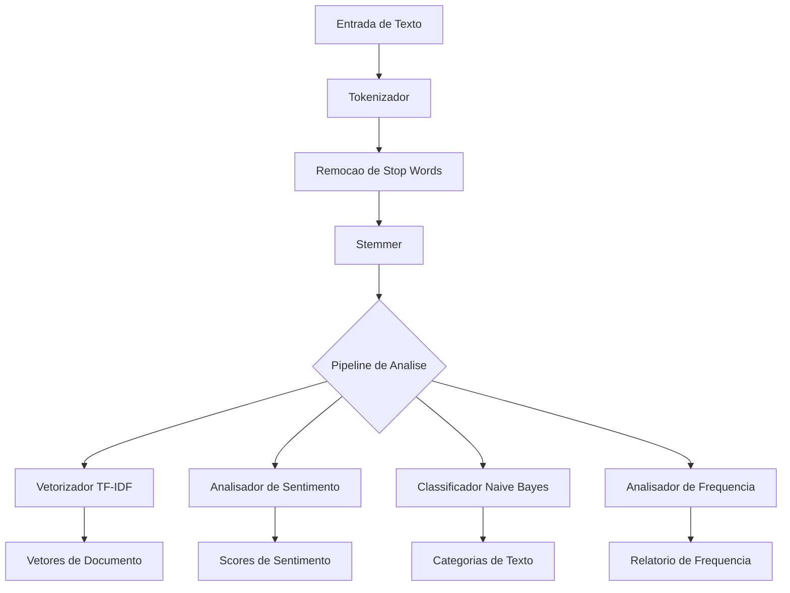

# Natural Language Processing Suite

<div align="center">


</div>

**[English](#english)** | **[Portugues (BR)](#portugues-br)**

---

## English

### Overview

A comprehensive Natural Language Processing toolkit implementing core NLP algorithms from scratch in Python. Includes tokenization, stemming, stop word removal, TF-IDF vectorization, lexicon-based sentiment analysis, Naive Bayes text classification, and word frequency analysis.

### Architecture



### Pipeline Flow



### Features

- **Tokenizer**: Word, sentence, character, and n-gram tokenization
- **Stemmer**: Simplified Porter stemmer implementation
- **Stop Words**: English and Portuguese stop word removal with custom lists
- **TF-IDF Vectorizer**: Fit-transform API with configurable max features
- **Sentiment Analysis**: Lexicon-based with negation detection and intensifiers
- **Naive Bayes**: Multinomial classifier with Laplace smoothing and probability output
- **Word Frequency**: Distribution analysis, type-token ratio, and text comparison

### Project Structure

```
Natural-Language-Processing-Suite/
├── src/
│   ├── __init__.py
│   ├── tokenizer.py         # Tokenization strategies
│   ├── stemmer.py           # Porter stemmer
│   ├── stopwords.py         # Stop word removal (EN/PT)
│   ├── tfidf.py             # TF-IDF vectorizer
│   ├── sentiment.py         # Lexicon sentiment analysis
│   ├── naive_bayes.py       # Naive Bayes classifier
│   └── word_frequency.py    # Word frequency analysis
├── tests/
│   └── test_nlp_suite.py
├── requirements.txt
└── README.md
```

### Installation

```bash
git clone https://github.com/galafis/Natural-Language-Processing-Suite.git
cd Natural-Language-Processing-Suite
pip install -r requirements.txt
```

### Usage

```python
from src.tokenizer import Tokenizer
from src.stopwords import StopWordRemover
from src.tfidf import TfidfVectorizer
from src.sentiment import LexiconSentimentAnalyzer
from src.naive_bayes import NaiveBayesClassifier

# Tokenization pipeline
tokenizer = Tokenizer()
tokens = tokenizer.word_tokenize("Natural language processing is fascinating.")

# Remove stop words
remover = StopWordRemover()
clean_tokens = remover.remove(tokens)

# Sentiment analysis
analyzer = LexiconSentimentAnalyzer()
result = analyzer.analyze("This product is excellent and amazing!")
print(result["sentiment"], result["compound"])

# Text classification
clf = NaiveBayesClassifier()
clf.fit(["great product", "terrible service"], ["positive", "negative"])
print(clf.predict("great service"))
```

### Running Tests

```bash
pytest tests/ -v
```

### Author

**Gabriel Demetrios Lafis**
- [GitHub](https://github.com/galafis)
- [LinkedIn](https://www.linkedin.com/in/gabriel-demetrios-lafis-62197711b)

---

## Portugues BR

### Visao Geral

Um toolkit completo de Processamento de Linguagem Natural implementando algoritmos fundamentais de NLP do zero em Python. Inclui tokenizacao, stemming, remocao de stop words, vetorizacao TF-IDF, analise de sentimento baseada em lexico, classificacao de texto Naive Bayes e analise de frequencia de palavras.

### Arquitetura



### Funcionalidades

- **Tokenizador**: Tokenizacao por palavras, sentencas, caracteres e n-gramas
- **Stemmer**: Implementacao simplificada do stemmer Porter
- **Stop Words**: Remocao em Ingles e Portugues com listas customizaveis
- **TF-IDF**: Vetorizador com API fit-transform e features configuraveis
- **Analise de Sentimento**: Baseada em lexico com deteccao de negacao e intensificadores
- **Naive Bayes**: Classificador multinomial com suavizacao de Laplace
- **Frequencia de Palavras**: Analise de distribuicao e comparacao de textos

### Instalacao

```bash
git clone https://github.com/galafis/Natural-Language-Processing-Suite.git
cd Natural-Language-Processing-Suite
pip install -r requirements.txt
```

### Executando os Testes

```bash
pytest tests/ -v
```

---

## License

MIT License - see [LICENSE](LICENSE) for details.
